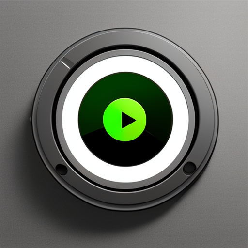

# kickVlogDL 
<a name="readme-top"></a>

[![Contributors][contributors-shield]][contributors-url]
[![Forks][forks-shield]][forks-url]
[![Stargazers][stars-shield]][stars-url]
[![Issues][issues-shield]][issues-url]
[![MIT License][license-shield]][license-url]
[![LinkedIn][linkedin-shield]][linkedin-url]

<br />
<div align="center">
  <a href="https://github.com/Yalton/kickVlogDL">
    
  </a>
  <h3 align="center">kickVlogDL - Kick VOD Downloader</h3>
  <p align="center">
    Simple tool designed to download kick VODs
    <br />
    <a href="https://github.com/Yalton/kickVlogDL"><strong>Explore the docs »</strong></a>
    <br />
    <br />
    <a href="https://github.com/Yalton/kickVlogDL">View Demo</a>
    ·
    <a href="https://github.com/Yalton/kickVlogDL/issues">Report Bug</a>
    ·
    <a href="https://github.com/Yalton/kickVlogDL/issues">Request Feature</a>
  </p>
</div>
<details>
  <summary>Table of Contents</summary>
  <ol>
    <li>
      <a href="#about-the-project">About The Project</a>
      <ul>
        <li><a href="#built-with">Built With</a></li>
      </ul>
    </li>
    <li>
      <a href="#getting-started">Getting Started</a>
      <ul>
        <li><a href="#prerequisites">Prerequisites</a></li>
        <li><a href="#installation">Installation</a></li>
      </ul>
    </li>
    <li><a href="#roadmap">Roadmap</a></li>
    <li><a href="#contributing">Contributing</a></li>
    <li><a href="#license">License</a></li>
    <li><a href="#contact">Contact</a></li>
    <li><a href="#acknowledgments">Acknowledgments</a></li>
  </ol>
</details>

## About The Project

All you need to do is enter the URL of the VOD you want to download, choose your preferred resolution, and voilà 
a download link will appear. Please note, higher resolutions lead to larger files and may take a bit longer to
download.

Tool automatically cleans downloads that are older than 8 hours, i.e your vods are not saved on the server
longterm. Which for you means two things

Offical Hosted Instance is available at [link](https://kvlogdl.billbert.co)

<p align="right">(<a href="#readme-top">back to top</a>)</p>


### Built With

* [![Node.js][nodejs-badge]][nodejs-url]
* [![Express.js][expressjs-badge]][expressjs-url]
* [![TypeScript][typescript-badge]][typescript-url]
* [![HTML5][html-badge]][html-url]
* [![CSS3][css-badge]][css-url]

<p align="right">(<a href="#readme-top">back to top</a>)</p>


<!-- GETTING STARTED -->
## Getting Started

Clone the repository to your local system 

### Prerequisites

You will require some local system packages to make the app function properly 
* apt
  ```sh
  apt install ffmpeg chromium aria2c npm
  ```

### Installation


1. Clone the repo
   ```sh
   git clone https://github.com/Yalton/kickVlogDL.git
   ```
2. Install nvm (Node Version Manager)
   ```sh
   curl https://raw.githubusercontent.com/creationix/nvm/master/install.sh | bash
   ```
3. Install node version 17 
   ```
    nvm install 17
   ```
4. Use node version 17 
    ```
    nvm use 17
    ```
5. Install uuid and save-dev (Behaves weirdly so we do this seperate)
   ```
    npm install uuid
    npm install --save-dev @types/uuid
   ```
6. Install NPM packages
   ```sh
   npm update
   ```
7. Build Typescript backend 
   ```
   npm run build
   ```
8. Start the server
   ```
    npm start
   ```

#### Dockerized 

Follow steps 1-6

8. Build the container
   ```
    docker compose build
   ```

9. Build the container
   ```
    docker compose up -d
   ```

Either solution will be accesible from the same interface @ localhost:3000

<p align="right">(<a href="#readme-top">back to top</a>)</p>


<!-- ROADMAP -->
## Roadmap

- [ ] Improve Queue system
- [ ] Allow certain users to bypass queue under given circumstances
- [ ] Improve overall UI

See the [open issues](https://github.com/Yalton/kickVlogDL/issues) for a full list of proposed features (and known issues).

<p align="right">(<a href="#readme-top">back to top</a>)</p>


<!-- CONTRIBUTING -->
## Contributing

Contributions are what make the open source community such an amazing place to learn, inspire, and create. Any contributions you make are **greatly appreciated**.

If you have a suggestion that would make this better, please fork the repo and create a pull request. You can also simply open an issue with the tag "enhancement".
Don't forget to give the project a star! Thanks again!

1. Fork the Project
2. Create your Feature Branch (`git checkout -b feature/AmazingFeature`)
3. Commit your Changes (`git commit -m 'Add some AmazingFeature'`)
4. Push to the Branch (`git push origin feature/AmazingFeature`)
5. Open a Pull Request

<p align="right">(<a href="#readme-top">back to top</a>)</p>

<!-- LICENSE -->
## License

Distributed under the MIT License. See `LICENSE.txt` for more information.

<p align="right">(<a href="#readme-top">back to top</a>)</p>

<!-- CONTACT -->
## Contact

Dalton Bailey - [@yalt7117](https://twitter.com/yalt7117) - drbailey117@gmail.com

Project Link: [https://github.com/Yalton/kickVlogDL](https://github.com/Yalton/kickVlogDL)

<p align="right">(<a href="#readme-top">back to top</a>)</p>


<!-- ACKNOWLEDGMENTS -->
## Acknowledgments

* [InspirationRedditPost](https://www.reddit.com/r/KickStreaming/comments/14fv85p/how_you_can_download_kick_vods/)

<p align="right">(<a href="#readme-top">back to top</a>)</p>


<!-- MARKDOWN LINKS & IMAGES -->
<!-- https://www.markdownguide.org/basic-syntax/#reference-style-links -->

[nodejs-badge]: https://img.shields.io/badge/Node.js-339933?style=for-the-badge&logo=nodedotjs&logoColor=white
[nodejs-url]: https://nodejs.org

[expressjs-badge]: https://img.shields.io/badge/Express.js-000000?style=for-the-badge&logo=express&logoColor=white
[expressjs-url]: https://expressjs.com

[typescript-badge]: https://img.shields.io/badge/TypeScript-3178C6?style=for-the-badge&logo=typescript&logoColor=white
[typescript-url]: https://www.typescriptlang.org

[html-badge]: https://img.shields.io/badge/HTML5-E34F26?style=for-the-badge&logo=html5&logoColor=white
[html-url]: https://www.w3.org/html/

[css-badge]: https://img.shields.io/badge/CSS3-1572B6?style=for-the-badge&logo=css3&logoColor=white
[css-url]: https://www.w3.org/Style/CSS/Overview.en.html


[python-badge]: https://img.shields.io/badge/Python-3776AB?style=for-the-badge&logo=python&logoColor=white
[python-url]: https://www.python.org
[contributors-shield]: https://img.shields.io/github/contributors/Yalton/kickVlogDL.svg?style=for-the-badge
[contributors-url]: https://github.com/Yalton/kickVlogDL/graphs/contributors
[forks-shield]: https://img.shields.io/github/forks/Yalton/kickVlogDL.svg?style=for-the-badge
[forks-url]: https://github.com/Yalton/kickVlogDL/network/members
[stars-shield]: https://img.shields.io/github/stars/Yalton/kickVlogDL.svg?style=for-the-badge
[stars-url]: https://github.com/Yalton/kickVlogDL/stargazers
[issues-shield]: https://img.shields.io/github/issues/Yalton/kickVlogDL.svg?style=for-the-badge
[issues-url]: https://github.com/Yalton/kickVlogDL/issues
[license-shield]: https://img.shields.io/github/license/Yalton/kickVlogDL.svg?style=for-the-badge
[license-url]: https://github.com/Yalton/kickVlogDL/blob/master/LICENSE.txt
[linkedin-shield]: https://img.shields.io/badge/-LinkedIn-black.svg?style=for-the-badge&logo=linkedin&colorB=555
[linkedin-url]: https://linkedin.com/in/dalton-r-bailey
[product-screenshot]: images/screenshot.png
[Next.js]: https://img.shields.io/badge/next.js-000000?style=for-the-badge&logo=nextdotjs&logoColor=white
[Next-url]: https://nextjs.org/
[React.js]: https://img.shields.io/badge/React-20232A?style=for-the-badge&logo=react&logoColor=61DAFB
[React-url]: https://reactjs.org/
[Vue.js]: https://img.shields.io/badge/Vue.js-35495E?style=for-the-badge&logo=vuedotjs&logoColor=4FC08D
[Vue-url]: https://vuejs.org/
[Angular.io]: https://img.shields.io/badge/Angular-DD0031?style=for-the-badge&logo=angular&logoColor=white
[Angular-url]: https://angular.io/
[Svelte.dev]: https://img.shields.io/badge/Svelte-4A4A55?style=for-the-badge&logo=svelte&logoColor=FF3E00
[Svelte-url]: https://svelte.dev/
[Laravel.com]: https://img.shields.io/badge/Laravel-FF2D20?style=for-the-badge&logo=laravel&logoColor=white
[Laravel-url]: https://laravel.com
[Bootstrap.com]: https://img.shields.io/badge/Bootstrap-563D7C?style=for-the-badge&logo=bootstrap&logoColor=white
[Bootstrap-url]: https://getbootstrap.com
[JQuery.com]: https://img.shields.io/badge/jQuery-0769AD?style=for-the-badge&logo=jquery&logoColor=white
[JQuery-url]: https://jquery.com 